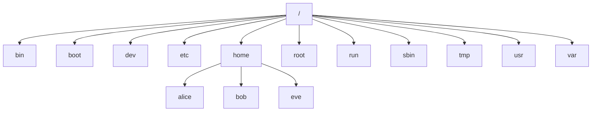
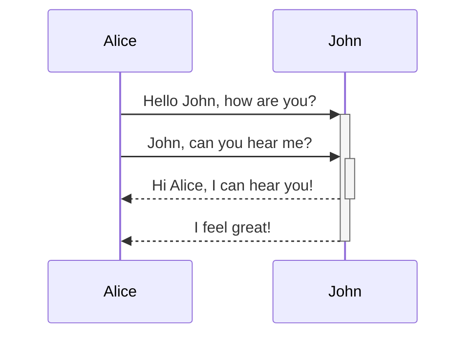
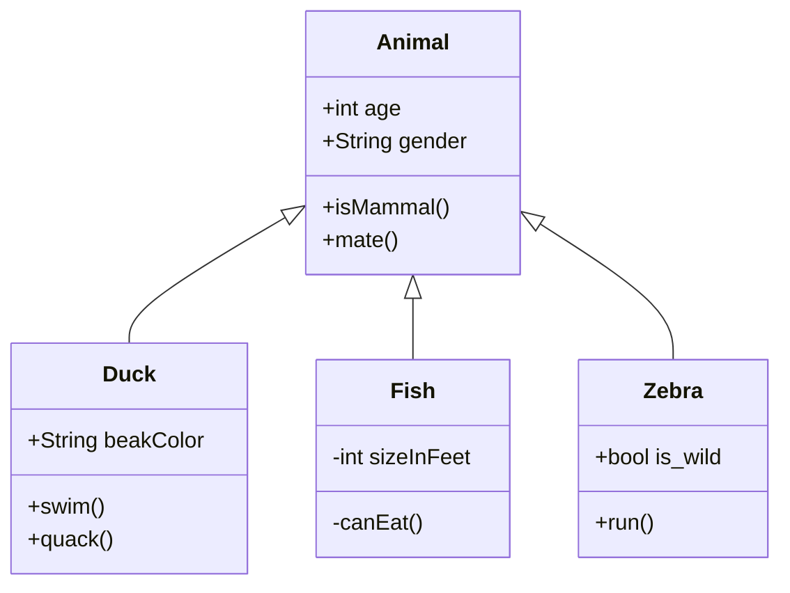
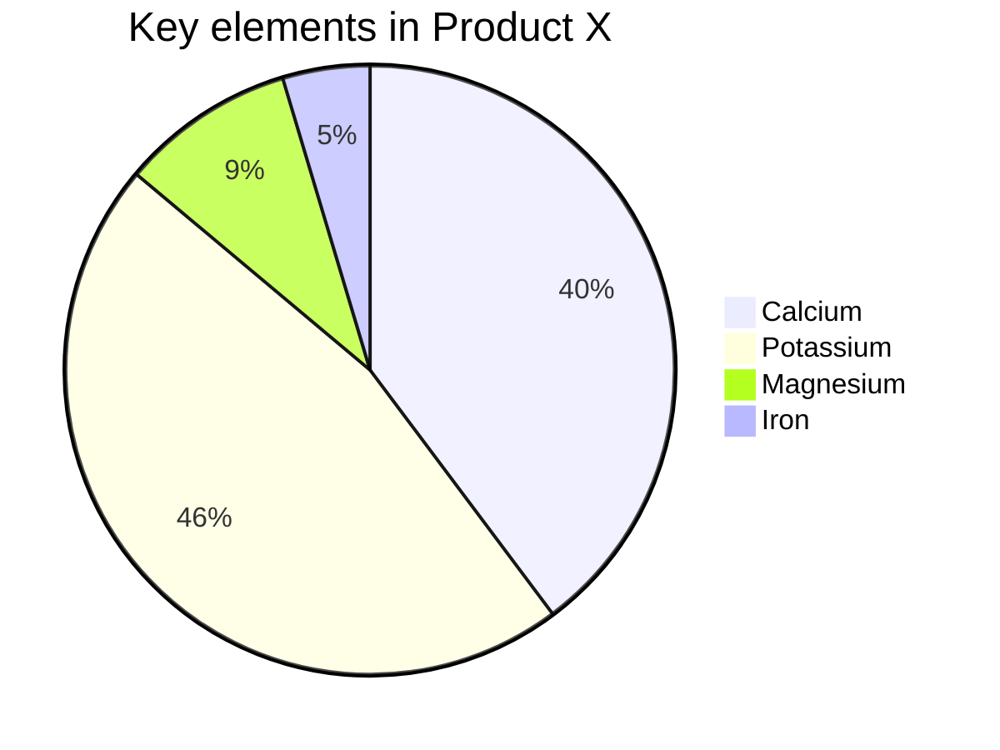
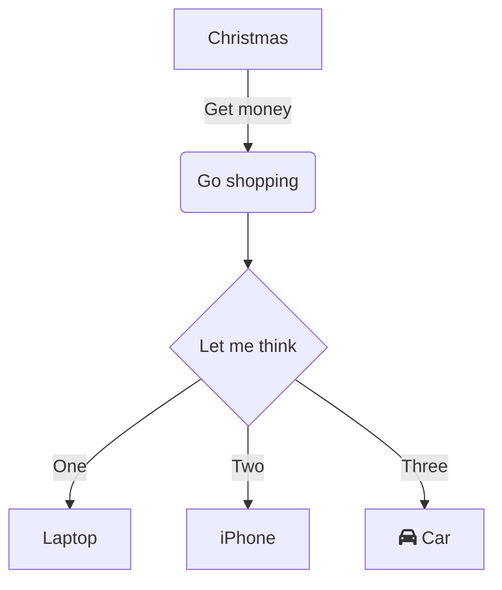
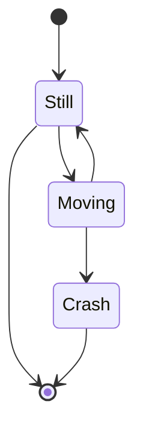
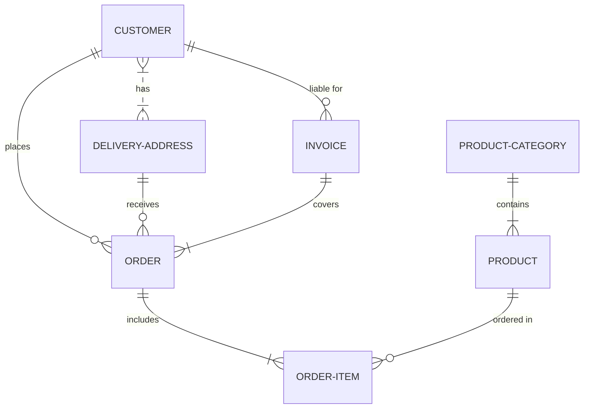
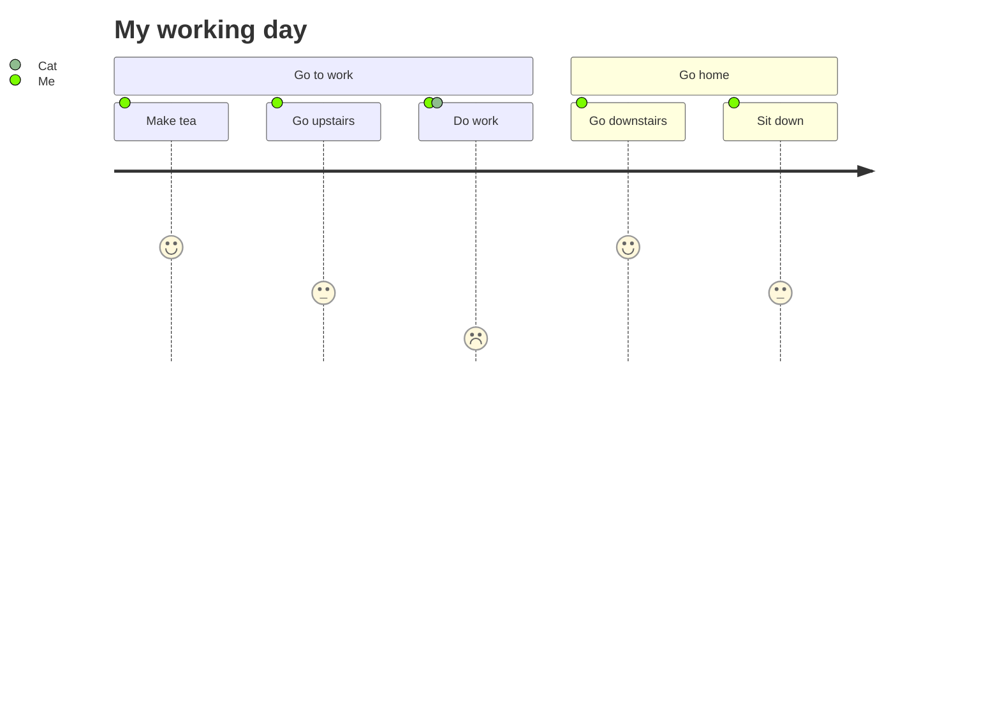
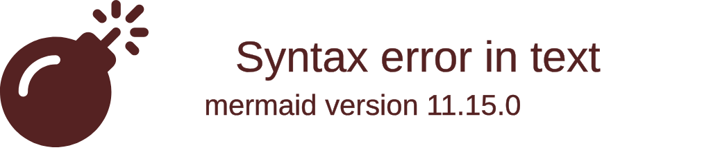

# Bluemountain
[toc]

原版请看[Markdown Reference (typora.com.cn)](https://support.typora.com.cn/Markdown-Reference/)


# 标题1

## 标题2

### 标题3

##### 标题4

>>>
>>>
>>>> > > 
>
>>>
>>
>>>
>
>​                


## un-ordered list

* Red
* Green
* Blue

## ordered list 

1. red
2. Green
3. Blue

- [ ] use Typora

```c
#include<stdio.h>
int main()
{
	printf("hello,world");
}
```

$$ \mathbf{V}_1 \times \mathbf{V}_2 =  \begin{vmatrix} \mathbf{i} & \mathbf{j} & \mathbf{k} \\ \frac{\partial X}{\partial u} &  \frac{\partial Y}{\partial u} & 0 \\ \frac{\partial X}{\partial v} &  \frac{\partial Y}{\partial v} & 0 \\ \end{vmatrix} $$


| 我是伞兵 | 我是麻痹 | 我是括约肌 |
| :------------ |:---------------:| :----:|
| 属于是 | 破防了 | 绝绝子 |
| XXX，但是XXX | 蚌埠住了 | 鼠鼠 |

小夫我要进来了[^1]

[^1]:出自禾野男孩

***

---
[是男人就来砍我](http://www.snszg.cn/ "传奇霸业私服")


跳转到[标题1](#标题1)ctrl+鼠标左键点击


我是[4399快乐器][id] 

[id]: http://www.4399.com/	"“好康的”"


[Baidu][] And then define the link: 

[Baidu]: http://Baidu.com/


<www.google.com>


### 对字符的改变

*wish<em>guis*

_ws<em>wda_

[猫片](file://S:/heritage/大学生活)，注意要使用英文符号

**woshisha**

**bi**

__wshishabi__

<!----注释 ---->

` import this`

~~miakeken text~~

<u>fuck</u>

awd


 ==\=\= \=\===

<span style="color:red; background-color:pink">this text is red</span>

:clown_face:   :joy:    :point_up_2:  :dancers:

### LATEX

$\lim_{x \to \infty} \exp(-x) = 0$


$$
\ce{H2}+\ce{O2}\xlongequal[]{王艳}\ce{H2O}
$$

$$
H_2 O
$$

$$
H^2 O
$$


<iframe height='265' scrolling='no' title='Fancy Animated SVG Menu' src='http://codepen.io/jeangontijo/embed/OxVywj/?height=265&theme-id=0&default-tab=css,result&embed-version=2' frameborder='no' allowtransparency='true' allowfullscreen='true' style='width: 100%;'> </iframe>

使用 <kbd>Ctrl</kbd>+<kbd>Alt</kbd>+<kbd>Del</kbd> 重启电脑
<kbd> </kbd> -- 白色框框


## Mermaid

```mermaid
gantt
    title 三下乡
    dateFormat DD
    section 廖青松
    A task           :a1, 2022-07-07, 5d
    Another task     :after a1  , 1d
    section 李豪
    Task in sec      :2022-07-07  , 5d
     section 数模三人
    Task in sec      :2022-07-07  , 5d
    another task      : 1d
     section 杨欢、陈鑫、王海霞、代宇、李玉梅
    Task in sec      :2022-07-07  , 5d
```
























```go
package main

import "fmt"

func main() {
    fmt.Println("Hello world") 
}

```
