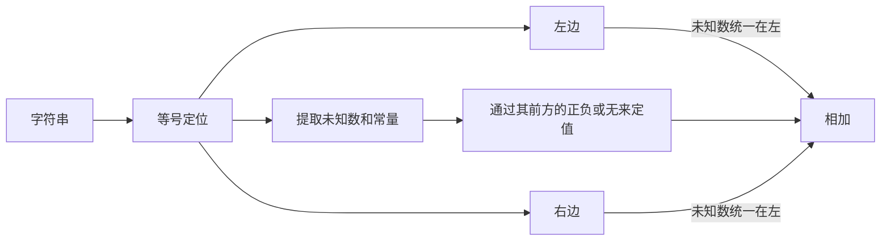

# P1022 [NOIP2000 普及组] 计算器的改良

---

## 解题思路:

```go
/*
一整串输入作为什么数据类型?
go语言是如何处理字符串的
以中间等号为区分
对含有a的的和不含a的进行区分
将数字提取出来,并看它前面是正还是负还是没有
*/
```



:crying_cat_face: 寄

- 思路不细致,越做越乱,一直以测试点为目标,反而误了大局

- 不善用断点来进行debug, 前期一直靠想

