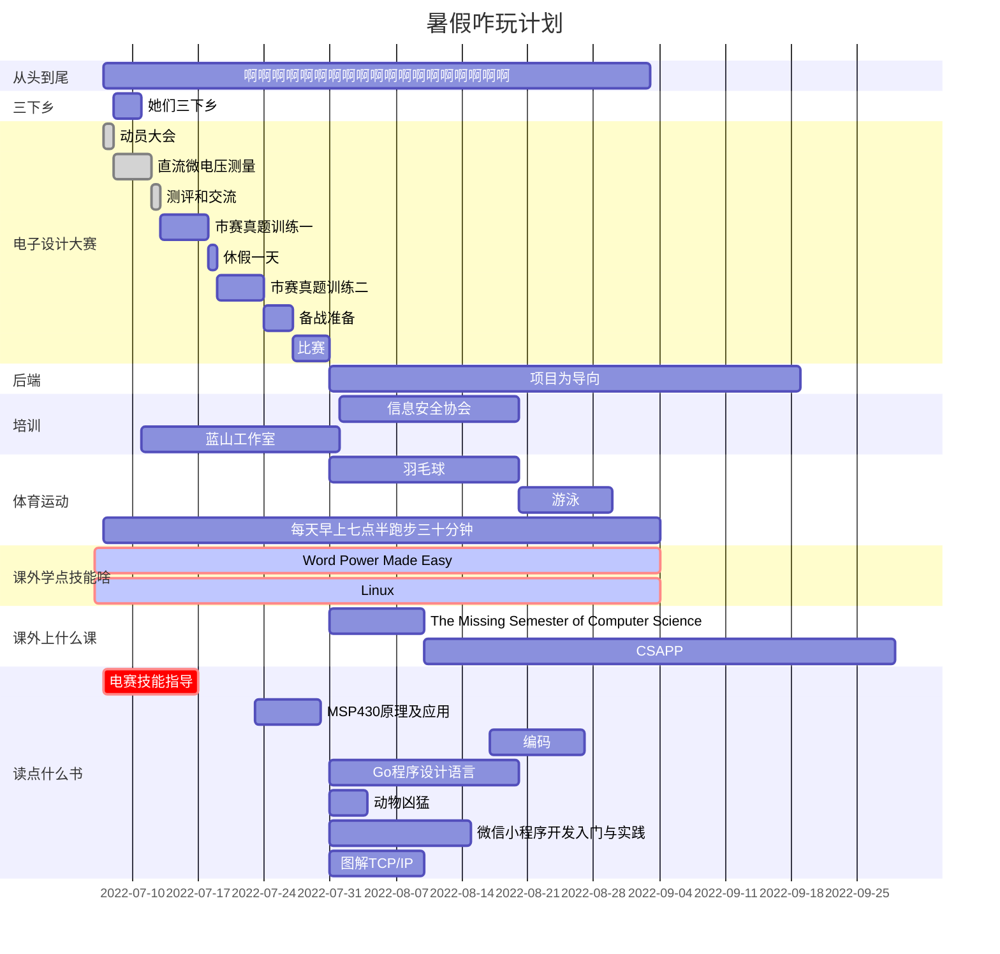

## Voyaging through strange seas of thoughts,alone

<ruby>基础<rp> (</rp><rt>真的是基础</rt><rp>) </rp></ruby>：C语言课程（CSS、写库、用库、位操作、指针、结构体、共用体）、数模电（放大电路、滤波电路、运算放大电路、AD/DA转换）、单片机原理与系统设计（MSP430怎么用）、仿真(Multisim)、PCB原理与设计（EDA）、工具的使用方法（焊台、万用表、示波器、热风枪、PCB实物制作）

进阶 (真的是骚) <ruby>进阶<rp> (</rp><rt>真的是骚</rt><rp>) </rp></ruby>：上位机（通过手机、电脑上的APP直接控制或者显示单片机，C++、JAVA）、图形识别（openMV）、声控（网上有模块）、物联网（Wifi模块）、PID调节舵机、输出过流保护功能

### ***必 备 技 能***

**1、**PCB板制板能力，熟悉一些单片机系统的电路设计以及传感器的使用。设计好的电路怎样制版，怎样制版才能方便组装焊接，且减少相互干扰?采用怎样的工艺才能提高电路的精度等等问题都是最终成败的关键，而这就基于 PCB制版能力。

**2、**基本仪器使用，例如熟练万用表、示波器、扫频仪、信号源、频率计等仪表。

**3**、资料收集能力，国赛是全开放的，也就是说你可以上网，可以查阅资料，故赛前对资料的收集整理十分重要，甚至关键。

**4、**基本电路调试技能。多多加强动手能力，竞赛十分重视参赛者的动手能力，故对技能的要求是非常实在的东西，并非空谈。

**5、**自学能力，竞赛题目大多都包含一些新知识新思想，平时一般都未接触过，甚至指导老师也不一定听说过。所以在短时间内自学新知识并转化到实践中去的能力必不可少。

**6、**文档组织与撰写能力。竞赛包括撰写论文报告这一环节，且时间很紧，故这一能力也应具备。
